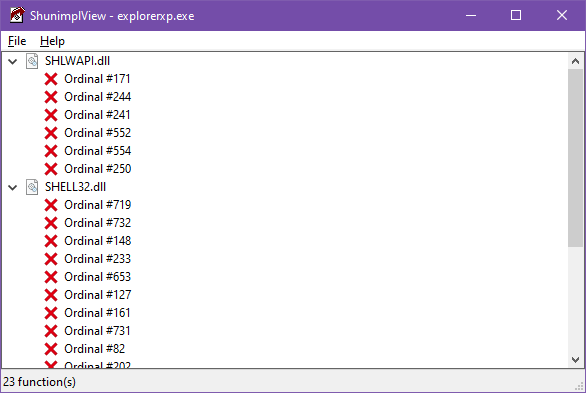

# ShunimplView
A lot of the time, components from older versions of Windows do not work on newer versions, because functions imported by them have been deprecated and moved to `SHUNIMPL.dll`. This utility provides a list of those functions.

## Note
This application relies on Windows' DLL APIs instead of parsing the file directly, so the machine type of the module must match the application. You'll need the x64 version of the application for x64 modules, and the x86 version for x86 modules.

## Screenshot
